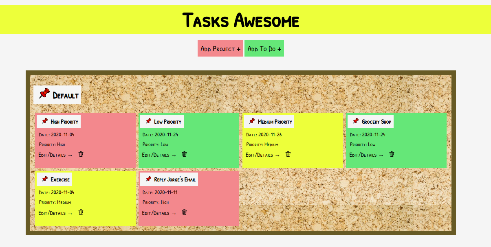

<h1 align="center">To-do List</h1>

⚠️ I am allowed by Microverse to make this Project Solo ⚠️

> A Javascript Web Application to manage your list of tasks. Applying concepts about OOP, ES6 resources and Functional Programming.

### You can access a Live Demo [HERE](https://raw.githack.com/MarilenaRoque/ToDoList/feature/app/dist/index.html)

## Features

- User can create Projects (A Default Project is automatically created)
- User can create a 'To Do' and choose what Project it should belong to
- The main page display all the Projects separated and its 'To Do's
- User can expand a 'To Do' to view its details or edit it
- The background color of the post-it is set according to the 'To Do' priority

## Built With

- Javascript
- Webpack
- HTML5
- CSS3

## Getting Started

To get a local copy of this project running follow these simple steps.

- Clone this repository
 > `git clone <repo>`
- Navigate to the Repo Folder
- To set Webpack and the dependencies run the command
> `npm install`
- Use your favorite browser to open the index.html file (located at the dist page)

## Authors

👤 **Marilena Roque**

- Github: [MarilenaRoque](https://github.com/MarilenaRoque)
- Twitter: [@MariRoq88285995](https://twitter.com/MariRoq88285995)
- Linkedin: [roquemarilena](https://www.linkedin.com/in/roquemarilena/)

## 🤝 Contributing

Contributions, issues and feature requests are welcome!

Feel free to check the [issues page](issues/).

## Show your support

Give a ⭐️ if you like this project!